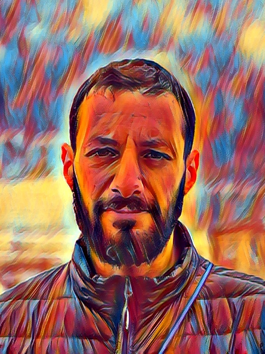

  
  

		
People usually introduce themselves by their name, e.g., “My name is Tomer”, and define themselves by their professional occupation, e.g. “I am a longevity researcher”. But I will not conform to these reductionistic norms.

		
After many years of holding back my thoughts and reflections, I've finally prompted myself to create this blog where I'll dump my philosophical musings on science, society, and various other topics. You’re welcome!

		
I also maintain a <a href="https://gammeetz.com/">blog on longevity</a> for laypeople, but be warned - it is written in an ancient biblical language.

		
In my spare time I practice the dark art of birdwatching. In 2005 I started <a href="https://www.israbirding.com/">this</a> website together with friends, which now looks like a relic from the 90s, yet some of its features are still used today.

		
I hold a PhD in biology and master’s degrees in physics and in philosophy.

   

   
     

    
  

